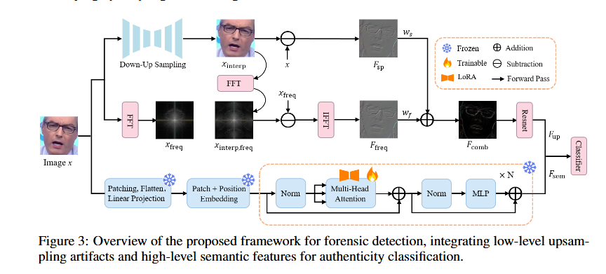

LanguageBind for Deepfake Detection

## Project Overview
This project utilizes the LanguageBind multimodal model for deepfake image detection, achieving efficient identification of AI-generated images by adding a simple classification head and fine-tuning. Based on leading pre-trained vision-language models, this project provides a lightweight solution that accurately distinguishes between real and deepfake images.


## Technical Architecture
- Base Model: LanguageBind multimodal model (CLIP architecture)
- Adaptation Method: Adding a classification head on the pre-trained model for fine-tuning
- Optimization Strategy: Freezing pre-trained model parameters, training only the classification layer



## File Structure
```
├── train_ClassifierHead.py    # Training script
├── test_ClassifierHead.py     # Testing script
└── deepfake/                  # Core module
    ├── __init__.py
    ├── deepfake_classifier.py # Classifier model definition
    └── deepfake_dataset.py    # Dataset loading class
```

## Core Features
- Multi-category Data Support: Handles multiple categories of deepfake data (e.g., car, cat, chair, horse, etc.)
- Transfer Learning: Leverages the powerful feature extraction capabilities of pre-trained models
- Model Evaluation: Uses Accuracy and Average Precision (AP) as primary evaluation metrics
- Progress Tracking: Detailed training and evaluation process output
- Model Saving: Automatically saves models for each epoch and the best-performing model

## Model Architecture
DeepfakeClassifier consists of two parts:

1. Feature Extractor: Frozen LanguageBind visual model
2. Classification Head: Simple network structure with two fully connected layers
   Linear(512/768 -> 256) -> ReLU -> Dropout(0.1) -> Linear(256 -> 2)

## Usage
### Training the Model

```
python train_ClassifierHead.py \
  --dataset_dir /path/to/dataset \
  --output_dir /path/to/save/model \
  --batch_size 512 \
  --num_epochs 50 \
  --categories car,cat,chair,horse
```

### Parameter Description
- `--dataset_dir`: Dataset directory
- `--output_dir`: Model output directory
- `--batch_size`: Training batch size
- `--num_epochs`: Number of training epochs
- `--learning_rate`: Learning rate (default 1e-4)
- `--seed`: Random seed (default 512)
- `--categories`: Training categories, comma-separated
- `--num_workers`: Number of worker threads for data loading

## Performance Metrics
The model evaluation uses two main metrics:

- Accuracy: Classification accuracy rate
- Average Precision (AP): Area under the precision-recall curve

## Environment Dependencies
- Python 3.9+
- PyTorch
- Transformers
- scikit-learn
- numpy
- tqdm
